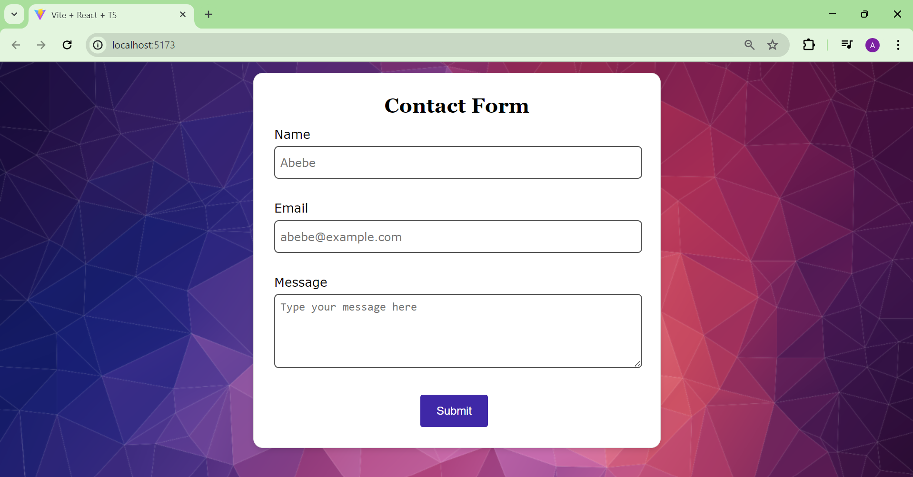
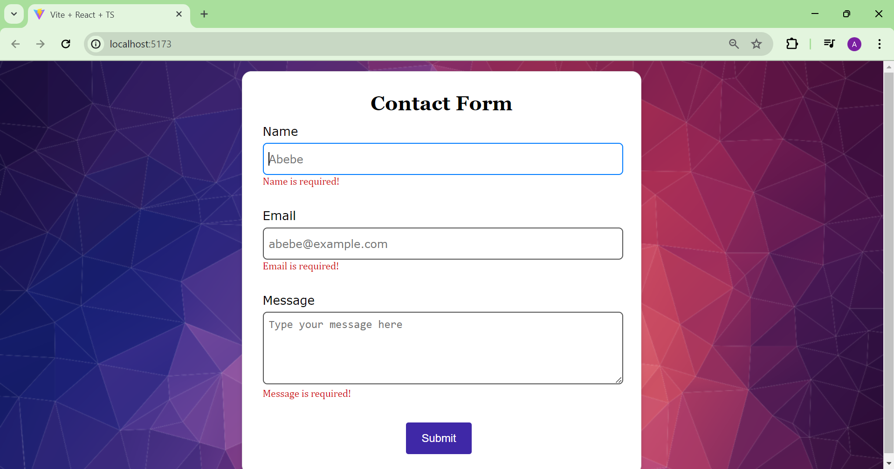
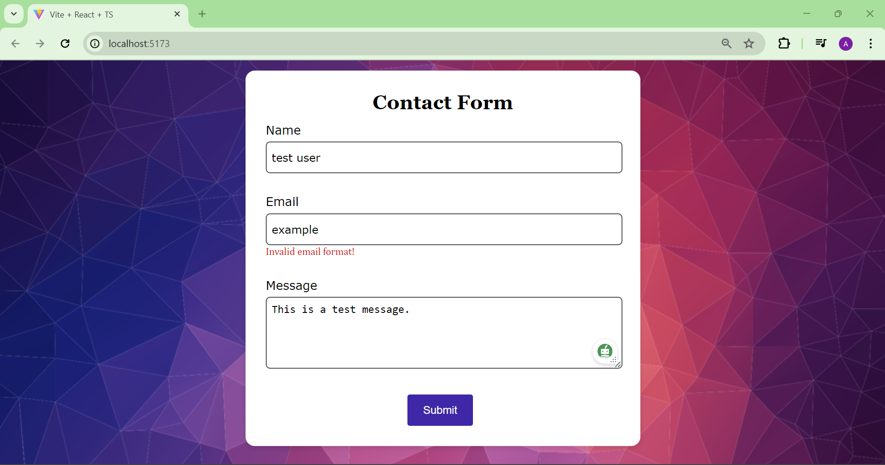

# Contact-form
Simple Contact Form using React and the `useForm` hook.

## Form validation

When the page loads initially you should see the following page.


## Required Fields
If you try to submit an empty content for a required field, you will see a reminder message below the input field.


## Invalid Email
If you enter an invalid email, you will be required to enter a valid email


## To run the app
You should have node installed.
Clone the repository and install dependencies by running the following commands:
```bash
git clone https://github.com/AregawiF/Contact-form.git
cd Contact-form
npm install
npm run dev
''' then follow the link to launch the website.
